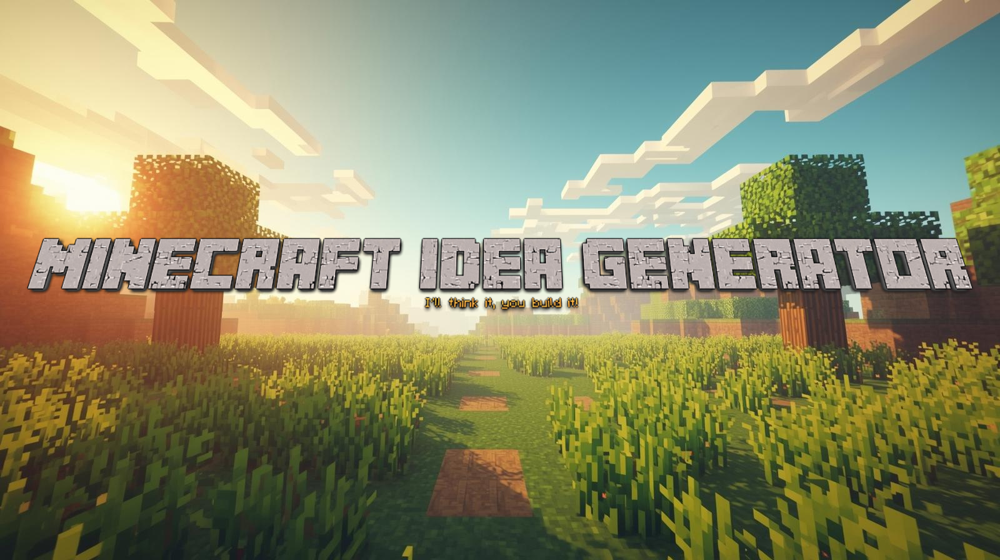

# minecraft-idea-generator



This a straightforward simple app that generates idea for Minecraft builds. It uses Azure Static WebApps to host the front end on the free tier and Azure Functions (consumption) for hosting the backend API for a free tier too. This uses Cloudflare AI Workers for the LLM integration because of their generous free tier usage. Super useful for experimentation. All images are AI generated and CoPilot used throughout too.

This repository contains two parts:

- `api/MinecraftIdeaApi` - .NET 8 Azure Functions (dotnet-isolated) backend that calls Cloudflare Workers AI to generate Minecraft build ideas.
- `frontend` - Vite + React + Tailwind frontend that calls the Functions API.

Local development

1. Backend (Functions)

```powershell
cd api/MinecraftIdeaApi
func start
```

Set secrets in `api/MinecraftIdeaApi/local.settings.json` (do NOT commit secrets) or use `dotnet user-secrets`

```json
{
	"IsEncrypted": false,
	"Values": {
		"AzureWebJobsStorage": "UseDevelopmentStorage=true",
		"FUNCTIONS_WORKER_RUNTIME": "dotnet-isolated",
		"CloudflareAI:AccountId": "YOUR_ACCOUNT_ID",
		"CloudflareAI:ApiToken": "YOUR_SECRET_TOKEN",
		"CloudflareAI:Model": "@cf/meta/llama-2-7b-chat-int8",
		"ApiSecret": "RANDOM_SECRET"
	}
}
```

2. Frontend

```powershell
cd frontend
npm install
npm run dev
```

Notes

- The frontend calls the function at `/api/GenerateIdea` and must include the header `X-API-SECRET` with a value matching `ApiSecret` in the Functions app.
- The GitHub Actions workflow `.github/workflows/azure-static-web-apps.yml` builds both the frontend and the Functions project and deploys them to Azure Static Web Apps. The `api_location` is set to `api/MinecraftIdeaApi`.